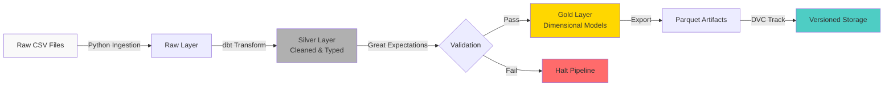
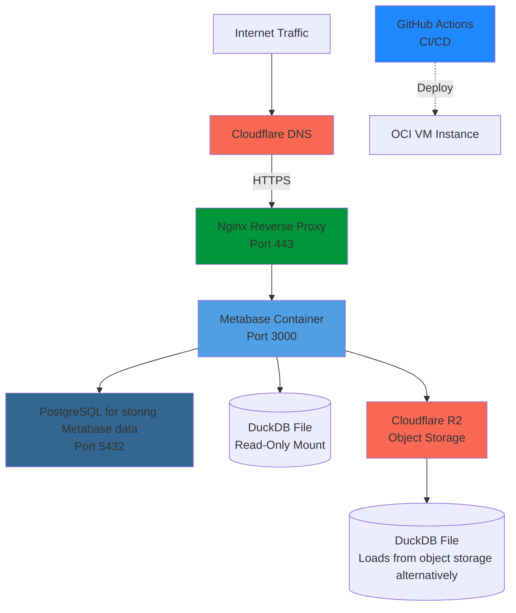

# GL-Pipeline

[](https://github.com/polarbear333/gl-pipeline/actions/workflows/deploy.yml)
[](LICENSE)
[](https://docs.getdbt.com/)
[](https://duckdb.org/)

A production-grade financial data pipeline demonstrating modern data engineering practices for general ledger processing. Built with dbt, DuckDB, and DVC to transform raw transaction data into auditable, analytics-ready dimensional models.

## What This Is

Most organizations process financial data through fragile Excel pipelines and manual transformations that break when data volumes grow. This project shows a better way by treating financial data pipelines with the same rigor as software builds.

GL-Pipeline implements a medallion architecture with automated validation gates, version-controlled artifacts, and full reproducibility. The entire pipeline runs locally without external databases or cloud dependencies, making it ideal for learning data engineering patterns or prototyping production systems.

## Architecture



The pipeline progresses through three layers:

**Bronze (Raw)**: Immutable source files with checksum verification and metadata tracking. Downloaded concurrently from Oklahoma State's public ledger dataset.

**Silver (Staging)**: Type-safe, deduplicated transactions with surrogate keys. Implements data cleaning (trimming, casting, null handling) and writes both to DuckDB and Parquet for downstream consumption.

**Gold (Analytics)**: Star schema with dimension tables (departments, accounts, fiscal calendar) and fact tables (transactions, monthly KPIs). Optimized for BI queries with pre-aggregated metrics.

Data quality is enforced at every boundary. Great Expectations validates Silver outputs against 20+ rules covering nullability, value ranges, and referential integrity. dbt tests ensure Gold models maintain business logic invariants. The pipeline halts on validation failures rather than propagating corrupt data.

## Deployment

The pipeline runs in production on Oracle Cloud Infrastructure with a Dockerized Metabase dashboard. See `docker-compose.yml` for the full stack (Nginx, Metabase, PostgreSQL). GitHub Actions automatically deploys on merge to `main`.

Key production patterns:
- DuckDB files provisioned from Cloudflare R2 object storage
- TLS termination with Let's Encrypt certificates
- Health checks and automatic container restarts
- Zero-downtime deployments via Docker Compose

The deployment stack consists of three containerized services:


## Tech Stack

- **dbt**: SQL-based transformations with dependency resolution, testing, and documentation
- **DuckDB**: Embedded OLAP database for fast analytical queries without server overhead
- **DVC**: Version control for datasets and pipeline orchestration with reproducible DAGs
- **Great Expectations**: Data validation framework with detailed quality reports
- **Python**: Concurrent ingestion, checksum verification, and pipeline glue
- **Metabase**: Deployed for structured and auditable analytics with dashboards 

## Getting Started

### Prerequisites

- Python 3.9+
- Git
- DVC (optional but recommended for full reproducibility)

### Installation

```bash
git clone https://github.com/polarbear333/gl-pipeline.git
cd gl-pipeline

python -m venv .venv
source .venv/bin/activate  

pip install -r requirements/base.txt
pip install dbt-duckdb duckdb dvc great_expectations
```

### Running the Pipeline

Option 1: Manual execution (step-by-step for learning)

```bash
# Download raw ledger files
python -m src.data.ingest_raw_data

# Initialize dbt dependencies
dbt deps --project-dir dbt_project
dbt seed --project-dir dbt_project

# Build Silver staging layer
dbt run --project-dir dbt_project --select stg_ledger

# Validate data quality
python scripts/validations/run_ge_validation.py

# Build Gold dimensional models
dbt run --project-dir dbt_project --models gold.*
dbt test --project-dir dbt_project
```

Option 2: Automated execution with DVC

```bash
# Run entire pipeline with dependency tracking
dvc repro
```

DVC intelligently skips stages where inputs haven't changed, making iterative development fast.

### Exploring the Results

After running the pipeline:

- **Silver Parquet**: `data/silver/stg_ledger.parquet` - Cleaned transactions
- **Gold Parquet**: `data/gold/*.parquet` - Dimensional models ready for BI tools
- **DuckDB Database**: `dbt_project/dbt_project.duckdb` - Query directly with DuckDB CLI
- **Validation Reports**: `great_expectations/uncommitted/data_docs/local_site/` - Open `index.html` in a browser

Query the data interactively:

```bash
duckdb dbt_project/dbt_project.duckdb

# Example queries
SELECT fiscal_year, department, SUM(total_revenue) 
FROM gold.kpi_monthly_summary 
GROUP BY 1, 2 
ORDER BY 1 DESC;

SELECT * FROM gold.dim_department;
```

## Project Structure

```
gl-pipeline/
├── src/
│   ├── data/                    # Ingestion logic and utilities
│   └── config/                  # Settings and environment vars
├── dbt_project/
│   ├── models/
│   │   ├── silver/              # Staging transformations
│   │   └── gold/                # Dimensional models (dims + facts)
│   ├── macros/                  # Reusable SQL functions
│   └── tests/                   # Custom dbt tests
├── great_expectations/          # Data validation config and suites
├── scripts/
│   ├── validations/             # GE validation runners
│   └── analysis/                # Exploratory notebooks
├── data/
│   ├── raw/                     # Bronze layer (immutable source)
│   ├── silver/                  # Cleaned Parquet outputs
│   └── gold/                    # Analytics-ready exports
├── dvc.yaml                     # Pipeline orchestration
└── requirements/                # Python dependencies
```

## Key Design Decisions

**DuckDB:** Eliminates database server overhead while providing PostgreSQL-compatible SQL and columnar performance. Handles millions of rows on a laptop. Perfect for development and medium-scale production workloads.

**Parquet:** Columnar storage reduces file sizes by 70% vs CSV and eliminates encoding issues. Native compression and schema enforcement catch data quality problems early.

**Why DVC over Airflow?** For pipelines that run on git push or nightly schedules, DVC provides 80% of Airflow's functionality with 20% of the complexity. No scheduler daemons, no web UI, just reproducible DAGs tracked in Git.

## Development

### Adding New Models

Create dbt models in `dbt_project/models/gold/`:

```sql
-- models/gold/my_new_metric.sql
WITH base AS (
    SELECT * FROM {{ ref('fact_ledger_transactions') }}
    WHERE fiscal_year = 2024
)

SELECT 
    department,
    SUM(amount) as total_amount
FROM base
GROUP BY 1
```

Add tests in the model's YAML schema:

```yaml
# models/gold/schema.yml
models:
  - name: my_new_metric
    columns:
      - name: department
        tests:
          - not_null
      - name: total_amount
        tests:
          - dbt_utils.expression_is_true:
              expression: ">= 0"
```

Run with: `dbt run --models my_new_metric && dbt test --models my_new_metric`

### Running Tests

```bash
ruff check .
mypy src/

dbt test --project-dir dbt_project
python scripts/validations/run_ge_validation.py
```

CI runs all checks automatically on pull requests.

## License

MIT License - see [LICENSE](LICENSE) file for details.

## Acknowledgments

Built with inspiration from dbt community best practices, DuckDB's excellent documentation, and Great Expectations' approach to data quality. Thanks to the maintainers of these open-source tools for making open source data engineering tools accessible.